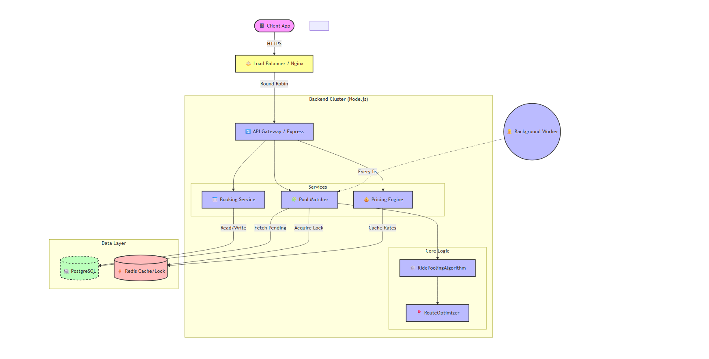
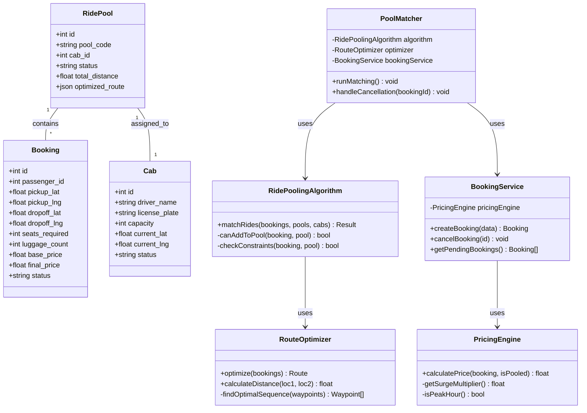

# System Design Documents

## 1. High-Level Design (HLD) - System Architecture

This diagram illustrates the high-level architecture of the Smart Airport Ride Pooling System, showing how different components interact to handle ride requests, matching, and data persistence.

*Note: This diagram illustrates the high-level architecture of the Smart Airport Ride Pooling System.*

### **Component Description:**

*   **Client App:** Sends booking requests and polls for status updates.
*   **Load Balancer:** Distributes incoming traffic across Node.js verify instances.
*   **Node.js API Cluster:** Handles concurrent requests using multiple processes.
*   **Service Layer:** Contains business logic for bookings, pricing, and matching.
*   **Algorithm Core:** Implements the ride pooling and route optimization logic.
*   **PostgreSQL:** Stores persistent data (users, bookings, rides).
*   **Redis:** Handles caching and distributed locking for concurrency control.
*   **Matching Worker:** Background process that periodically matches pending bookings.

---

## 2. Low-Level Design (LLD) - Class Diagram

This diagram details the core classes, their attributes, and relationships, following the Repository and Strategy patterns.

### **Design Patterns Used:**

*   **Singleton:** Applied to Database and Redis connections to ensure a single shared instance.
*   **Strategy:** Used in `PricingEngine` to allow flexible pricing strategies (e.g., surge, flat rate).
*   **Repository:** abstracted data access logic within Service classes.
*   **Factory:** Implicitly used in `PoolMatcher` to create new `RidePool` instances.
