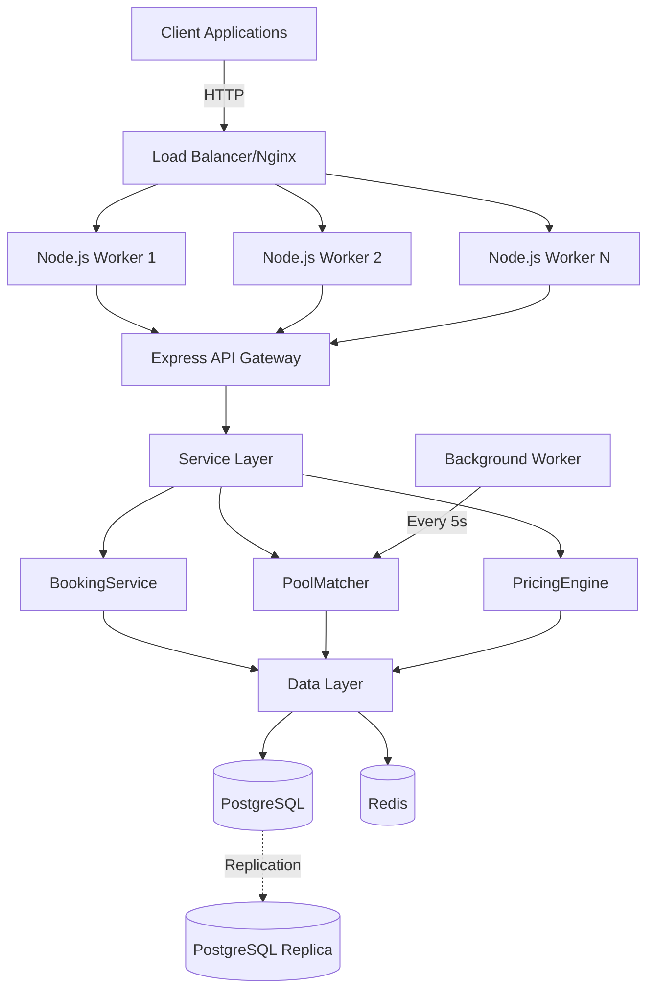
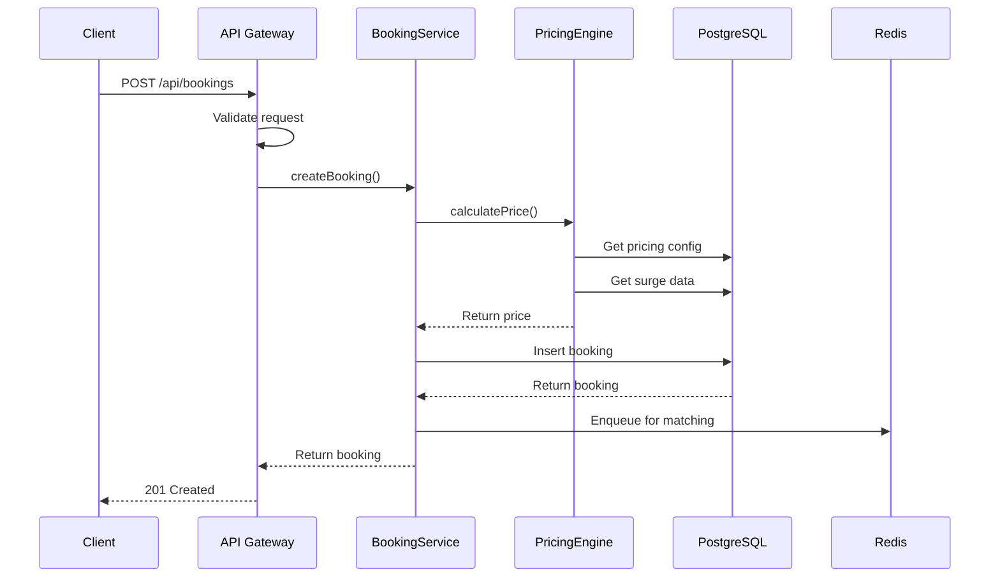
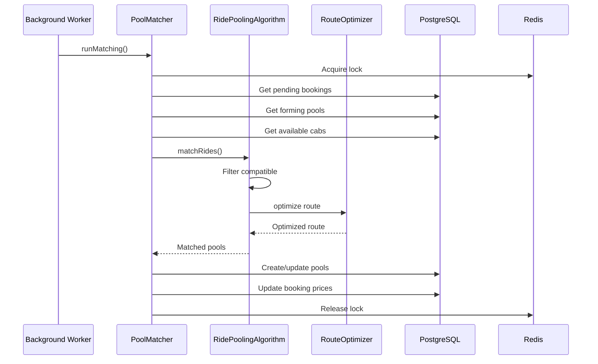
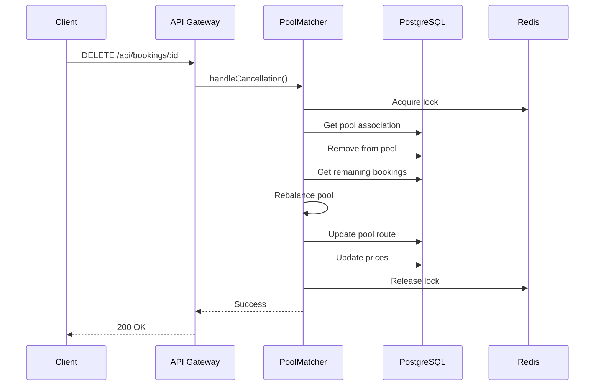

# High Level Architecture

## System Overview

The Smart Airport Ride Pooling Backend System is designed as a **Microservices-Ready Monolith** that can handle 10,000+ concurrent users with sub-300ms latency.

## Architecture Diagram

## Component Breakdown

### 1. Client Layer
- **Mobile Apps**: iOS, Android applications
- **Web Dashboard**: Admin portal for monitoring
- **Third-party Integrations**: Partner APIs

### 2. API Gateway
- **Framework**: Express.js with TypeScript
- **Responsibilities**:
  - Request routing
  - Input validation (Joi)
  - Rate limiting (100 RPS per IP)
  - Error handling
  - CORS management

### 3. Service Layer

#### BookingService
- CRUD operations for bookings
- Price calculation integration
- Status management

#### PoolMatcher
- Orchestrates ride pooling process
- Distributed locking (Redis)
- Pool creation and updates
- Cancellation handling with rebalancing

#### PricingEngine
- Dynamic surge pricing
- Demand/supply ratio calculation
- Peak hour multipliers
- Pool discount application

### 4. Algorithm Layer

#### RidePoolingAlgorithm
- Modified greedy matching
- Constraint satisfaction
- O(n log n) complexity
- Handles seat, luggage, proximity, detour constraints

#### RouteOptimizer
- TSP-based optimization
- Greedy nearest neighbor
- Pickup-before-dropoff enforcement

### 5. Data Layer

#### PostgreSQL
- **Purpose**: Persistent storage, ACID compliance
- **Tables**: passengers, cabs, bookings, ride_pools, pool_participants
- **Optimization**: 
  - B-tree indexes on status columns
  - GiST spatial indexes for location queries
  - Connection pooling (20 connections)

#### Redis
- **Purpose**: Caching, distributed locking, job queues
- **Usage**:
  - Distributed locks for concurrency control
  - Route calculation cache (5 min TTL)
  - Cab availability cache
  - Job queue for async matching

### 6. Background Workers

#### Matching Worker
- **Interval**: 5 seconds
- **Process**: Fetches pending bookings → Runs matching → Creates/updates pools
- **Locking**: Prevents concurrent matching conflicts

## Data Flow

### 1. Booking Creation Flow

### 2. Pool Matching Flow

### 3. Cancellation Flow

## Scalability Strategy

### Horizontal Scaling
- **Node.js Clustering**: One worker per CPU core
- **Database Read Replicas**: Route read queries to replicas
- **Redis Cluster**: Shard cache across nodes

### Vertical Scaling
- **Database**: Increase PostgreSQL memory, connections
- **Cache**: Expand Redis memory

### Performance Optimizations
1. **Connection Pooling**: Reuse database connections
2. **Query Optimization**: Strategic indexing
3. **Caching**: Route calculations, cab availability
4. **Async Processing**: Background matching workers
5. **Distributed Locking**: Prevent race conditions

## Monitoring & Observability

### Metrics
- Request latency (p50, p95, p99)
- Request throughput (RPS)
- Error rates
- Database query time
- Pool matching duration

### Logging
- Winston for structured logging
- Levels: error, warn, info, debug
- File-based in production
- Console in development

### Health Checks
- `/health` endpoint
- Database connectivity
- Redis connectivity

## Security Considerations

### Current Implementation
- Input validation (Joi)
- SQL injection prevention (parameterized queries)
- CORS configuration

### Future Enhancements
- JWT authentication
- Rate limiting per user
- API key management
- Data encryption
